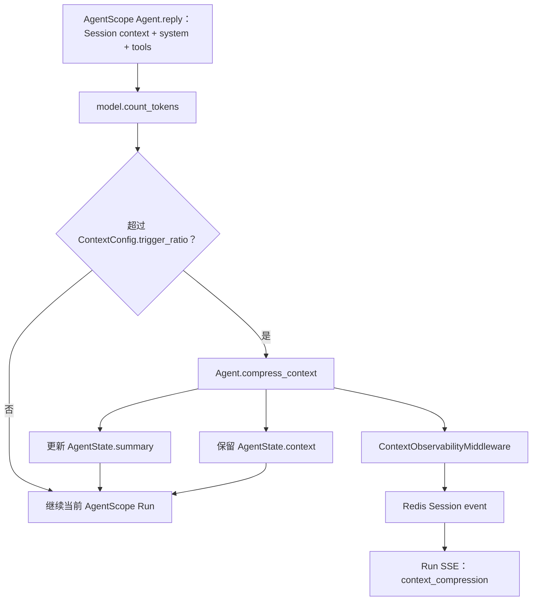

# 上下文压缩机制

长对话和大段工具结果会占用模型上下文。Yuxi 将智能体配置投影为 AgentScope `ContextConfig`，由 AgentScope `Agent` 在每轮推理前管理上下文压缩；Yuxi 只负责保存运行事实、提供 Workspace 作用域并把压缩状态投影到现有 Run/SSE 协议。配置入口见[智能体配置](../agents/agents-config.md)，运行主链路见[Agent 运行机制](./agent-runtime.md)。

## 事实和边界

1. AgentScope PostgreSQL Storage 保存 Session 的 `AgentState.summary` 与未压缩 `AgentState.context`。Yuxi PostgreSQL 保存 Conversation、Message、Request 和 AgentRun；压缩不会删除 Yuxi 聊天历史。
2. 上下文压缩只改变当前 AgentScope Session 的运行状态。运行结果、事件和错误仍绑定产生它们的同一 Request/Execution/Run，不能从相邻 Run 或消息推断。
3. 压缩文件由当前 AgentScope Workspace/Offloader 处理。用户可见文件路径必须继续经过 Yuxi Workspace/Sandbox 边界校验，宿主机路径不进入模型输入。

## 请求流程

AgentScope 使用模型的 `count_tokens` 计算是否达到触发比例，并根据 `reserve_ratio` 为压缩响应预留上下文空间。压缩成功后，较早消息被归入 `AgentState.summary`，未压缩消息保留在 `AgentState.context`；下一轮请求由 AgentScope 重新组合摘要和上下文。

## AgentScope 压缩行为

`ContextConfig` 的 `trigger_ratio` 限制压缩触发点，最大值为 `0.9`；`reserve_ratio` 必须小于触发比例。`compression_prompt` 和 AgentScope 原生的摘要 schema/template 控制摘要生成，`tool_result_limit` 限制工具结果在上下文中的长度。AgentScope 也会按其原生配置限制上下文中的图片数量。

压缩时，AgentScope 可以通过当前 Workspace Offloader 保存被压缩的消息或大工具结果，并在摘要中保留可重新定位的提醒。摘要生成失败时，AgentScope 保留已有摘要或使用截断提示，再将保留的消息写回 Session；失败详情由同一 Run 的错误和日志记录。不要把摘要失败当成相邻 Run 的成功结果。

## Yuxi 观测和可见性

`ContextObservabilityMiddleware` 在 AgentScope `on_model_call` 边界发布 `token_context` 与 `model_usage`，在 `on_compress_context` 边界发布 `context_compression` custom event。`token_context` 包含模型实际输入计数、字符近似的上下文构成、上下文窗口、触发 token、剩余 token 和 `summary_active`；字符近似只用于状态展示，不是计费口径。

Yuxi AgentScope gateway 将 `context_compression` custom event 转换为当前 Run 的 SSE `messages` 事件。正常压缩状态包含 `started` 和 `completed`；压缩异常沿同一 Run 的错误/终态路径传播，当前协议不凭空生成独立的 `failed` 压缩事件。内部摘要模型结果不作为用户可见的助手消息流出。

## 配置字段

| Yuxi Agent context 字段 | AgentScope 字段 | 默认值 | 作用 |
| --- | --- | ---: | --- |
| `summary_trigger_ratio` | `trigger_ratio` | `0.8` | 达到模型上下文窗口比例后触发压缩 |
| `summary_reserve_ratio` | `reserve_ratio` | `0.1` | 为压缩响应预留的上下文比例 |
| `summary_prompt` | `compression_prompt` | AgentScope 内置模板 | 指导摘要模型生成可继续执行的摘要 |
| `summary_tool_result_token_limit` | `tool_result_limit` | `50000` | 限制工具结果在上下文中的 token 数 |

`backend/package/yuxi/agentscope/projection.py` 读取 Yuxi Agent 配置并生成 `ContextConfig` 载荷。缺少字段时使用表中的默认值；非法比例或非正工具结果上限会在投影阶段显式失败。配置生效于新建或恢复 AgentScope Session 的运行时投影，不创建第二套压缩状态。

## 文件、权限和用量

摘要和大工具结果的持久文件属于当前 AgentScope Workspace。Workspace manager 按 Session 隔离目录，Yuxi Workspace/Artifact 服务负责用户可见的文件树、预览和权限；共享 Workspace 仍按用户绑定，不以请求参数绕过所有权检查。

`UsageAccumulator` 从同一 Session 的 `token_context`、`model_usage` 和 `context_compression` 事件聚合状态，并由 Run 服务写入当前 AgentRun 的用量投影。模型返回的原始 usage 用于计费和统计；字符近似值只能解释界面状态，不能替代模型实际用量。

## 失败和恢复时看什么

| 现象 | 先检查 |
| --- | --- |
| 事件显示开始但 Run 没有完成 | 同一 Run 的 error/终态事件、worker 日志和 AgentScope Session 状态 |
| 摘要后找不到旧内容 | 同一 Session 的 `AgentState.summary`、`AgentState.context` 和 Workspace Offloader 文件 |
| 任务仍提示上下文过大 | AgentScope `count_tokens` 结果、四个配置字段、工具 schema 和目标模型上下文窗口 |
| 前端出现内部摘要文本 | Run SSE 的事件类型和 `ContextObservabilityMiddleware`，确认没有把 AgentScope 内部消息当作助手消息 |
| 刷新后压缩状态消失 | 同一 Run 的事件流、AgentScope Session 状态和 Yuxi `ThreadStateService` 聚合结果 |

不要读取相邻 Session、相邻 Run 或共享路径来补全当前压缩结果。

## 源码和验证入口

- [AgentScope 运行时投影](https://github.com/xerrors/Yuxi/blob/main/backend/package/yuxi/agentscope/projection.py)
- [AgentScope 配置投影](https://github.com/xerrors/Yuxi/blob/main/backend/package/yuxi/agentscope/config_projection.py)
- [AgentScope 压缩观测 Middleware](https://github.com/xerrors/Yuxi/blob/main/backend/package/yuxi/agentscope/middleware.py)
- [AgentScope 事件协议](https://github.com/xerrors/Yuxi/blob/main/backend/package/yuxi/agentscope/protocol.py)
- [AgentScope gateway](https://github.com/xerrors/Yuxi/blob/main/backend/package/yuxi/agentscope/gateway.py)
- [Run 状态服务](https://github.com/xerrors/Yuxi/blob/main/backend/package/yuxi/services/agent_run_service.py)
- [上下文压缩投影单测](https://github.com/xerrors/Yuxi/blob/main/backend/test/unit/test_agentscope_projection_context.py)
- [上下文压缩协议单测](https://github.com/xerrors/Yuxi/blob/main/backend/test/unit/test_agentscope_protocol.py)
- [上下文压缩 E2E](https://github.com/xerrors/Yuxi/blob/main/backend/test/e2e/test_agent_context_compression_e2e.py)

修改压缩逻辑时，至少验证低于入口、触发原生压缩、摘要生成失败、工具结果过长和 SSE 断线恢复；oracle 应读取同一 Session 的 state、同一 Run 的 SSE/终态和 Workspace 文件，而不是只检查 mock 调用次数。
